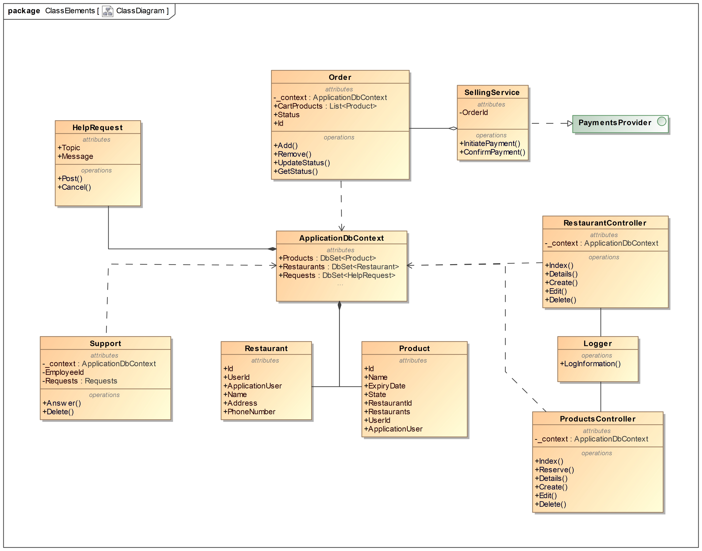

---
papersize:
- a4
fontsize:
- 12pt
geometry:
- margin=1in
fontfamily:
- charter
header-includes:
- \setlength\parindent{24pt}
---

\setcounter{page}{1}
\pagenumbering{arabic}
\begin{titlepage}
   \begin{center}
       \vspace*{1cm}

       \textbf{Food Waste}

       \vspace{1.5cm}

       \textbf{Arentas Meinorius,\\Jaunius Tamulevičius,\\Martinas Mačernius,\\Pijus Petkevičius}

       \vfill
            
       \vspace{0.8cm}
            
       Matematikos ir informatikos fakultetas\\
       Vilniaus universitetas\\
       Lietuva\\
       \today
            
   \end{center}
\end{titlepage}

# Summary {.unlisted .unnumbered}
&nbsp;&nbsp;&nbsp;&nbsp;The primary objective of the second laboratory assignment is to design the system and required changes. While in the first laboratory work we analysed business and all its processes, this time the attention on existing system and the changes. \

**The main tasks of our project are:** \
   1. Use UML 4+1 framework for organizing the architecture document. \
   2. Implement the planned changes in the system. \
   3. Introduce a CI/ID process. \
\clearpage
\tableofcontents
\clearpage

# Context
For a system to be successful, it must be developed with the intention of solving a real-world problem, which, in our case, is reducing food waste in restaurants and shops. The software is useless if it does not solve required problem. In this part we analyse our problem and how it is intended to be solved. 

## Goal of the system
Reduce food waste by distributing it.

### The problem
Not all food products are sold, often it is discounted, sometimes leftovers have to be discounted.

### Solution
//discussion

### Main User Goals 
//discussion

## Planned changes
To further develop and increase the functionality of the existing system we were given several tasks of implementing changes and features. The improvement consists of adding food status to facilitate consumers lifes and by adding restaurant/grocery store edit option.

### Change list
 + Product status implementation, when it is bought etc.\
 + Restaurant accounts should be able edit their data.\
 + Add tech support.

### Impact of changes
// discussion which change to implement

## Current system analysis
//analyse the system

### System environment
The main web-application server will be run on a linux machine using IIS Express. The database will be on the same server. Users will be able to connect through any type of modern browser. Support for older browsers (e.g., Internet Explorer) is not included. 

### Tools and Technologies
The main development tools and technologies, which are .NET Core Software framework, ASP.NET server-side application and razor framework. The database management system chosen by the original developers was Docker and and PostgreSQL. 
Overall, the tools and technologies are well chosen for the system in development. 

### Existing problems
## Development environment
Version control systems, play a major role in any modern software development project. This is especially important for us, since out team will mostly work remotely. Our version control system is Git. The source code is hosted on GitHub, because all of the members are familiar with this repository management tool. Following good coding practices, every new feature implementation will be reviewed by at least one team member.

# Logical view
Logical view is concerned with the functionality that the system provides to end-users. This will be achieved via these diagrams: \
1. Class diagrams, \
2. Object diagram, \
3. Collaboration diagrams, \
4. State machine diagrams. 

Each of these diagrams has a separate section in which diagrams itself and descriptions are provided.

## Class diagrams
The class diagram shown belown illustrates our application after the changes. We have included a new functionality of ordering the products and designed tech support. Also we kept in mind the necessity to manage restaurants and added some additional operations. This diagram allows us to implement the changes more easily with its structured view.

## Object diagram
## Collaboration diagrams
## State machine diagrams
The state diagram shown below illustrates how our ordering systems works in more depth. We can see that user adds or removes products to his order as he wishes and then proceeds to the payment. Once the payment is started, order status gets updated throughout the process and transaction is being verified. When the payment gets verified order finishes.

# Development view
  * The development view illustrates a system from programmer’s perspective and is concerned with software management. This view contains:
1. Component diagram

## Component diagram
# Process view
Process view illustrates and explains the system processes. The focus is on their communication and synchronization. This view contains: \
1. Activity diagrams,\
2. Sequence diagrams.

## Activity diagrams
## Sequence diagrams
# Physical view
In this part we analysed the topology of software components on the physical layer as well as physical connections between these components. 
This view contains:

1. Deployment diagram

## Deployment diagram
# Use Case View
## Main use cases – diagram and description
## Admin use cases – diagram and description
## User use cases – diagram and description
# Traceability
