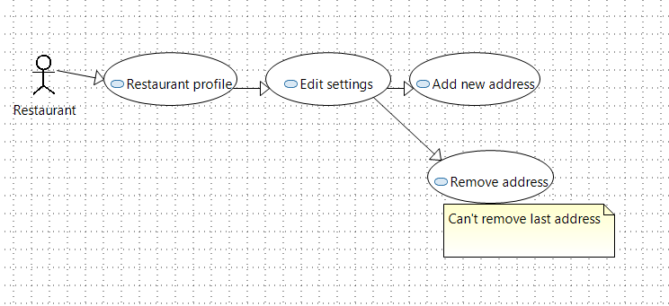
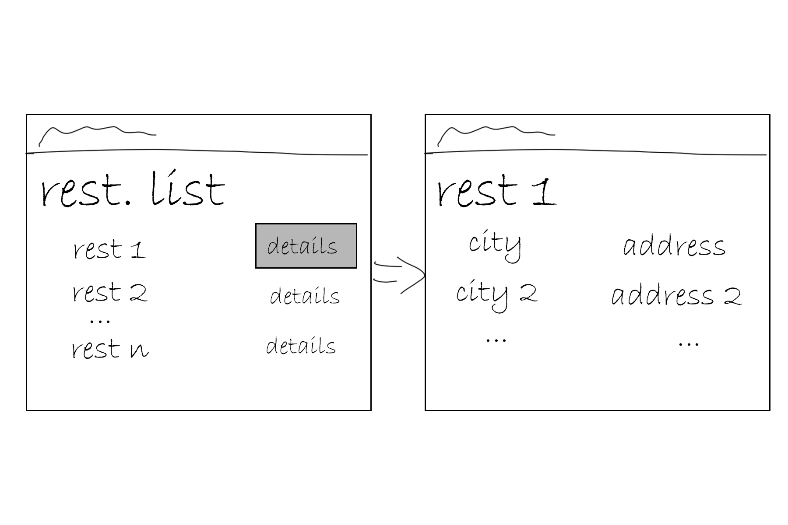
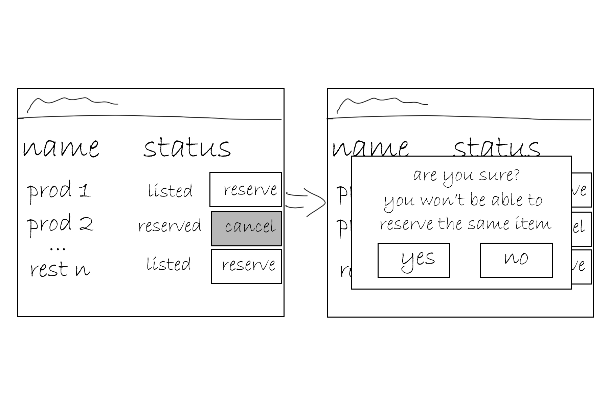

---
papersize:
- a4
fontsize:
- 12pt
geometry:
- margin=1in
fontfamily:
- charter
header-includes:
- \setlength\parindent{24pt}
---

\setcounter{page}{1}
\pagenumbering{arabic}
\begin{titlepage}
   \begin{center}
       \vspace*{1cm}

       \textbf{Food Waste}

       \vspace{1.5cm}

       \textbf{Arentas Meinorius,\\Jaunius Tamulevičius,\\Martinas Mačernius,\\Pijus Petkevičius}

       \vfill

       \vspace{0.8cm}

       Matematikos ir informatikos fakultetas\\
       Vilniaus universitetas\\
       Lietuva\\
       \today

   \end{center}
\end{titlepage}

# Summary {.unlisted .unnumbered}
&nbsp;&nbsp;&nbsp;&nbsp;The primary objective of the second laboratory assignment is to design the system and required changes. While in the first laboratory work we analysed business and all its processes, this time the attention on existing system and the changes. \

**The main tasks of this iteration:** \
   1. Domain model. \
   2. Use cases. \
   3. Sketches. \
\clearpage
\tableofcontents
\clearpage

# Context
For a system to be successful, it must be developed with the intention of solving a real-world problem, which, in our case, is reducing food waste in restaurants and shops. The software is useless if it does not solve required problem. In this part we analyse our problem and how it is intended to be solved. 

## Goal of the system
Reduce food waste by distributing it.

### The problem
Not all food products are sold before spoiling, sometimes restaurants do not use all the food they have bought.

### Solution
Prepare a plaftorm that would stand as a middle man helping people sell excess food while  allowing others to buy it cheaper.

## Planned changes
To further develop and increase the functionality of the existing system we created several tasks:

User registers to the platform and creates Restaurant account. User can have multiple restaurants (restaurant group). They can be added or removed when the user creates or edits profile data. When food product is added for the restaurant, user can choose one or more restaurants.

Every food Product has an allergens list. The list can be changed when the product is added or modified.

User can have Reservations of food products. Payment information is provided with the reservation.

User can have its favourite restaurants. In the page of a physical restaurant the user subscribes to the restaurant and its added to the favourite retaurans listm. The notifications are sent whenever the new products are added to the FoodWaste system favourite restaurant. User can also get notifications when an individual product is favoured.

### Change list
 + Restaurant might have multiple addresses.\
 + Remove reservation.\
 + Allergens tags on food products.\
 + Notifications for selected restaurants (whenever they add a new product)

\clearpage
### Impact of changes

### Domain model

### Glossary

### UI sketches

### Use case models

1. Multiple addresses for restaurant.

User: Might encounter offers from the same restaurant but with different address. Will be seeing restaurant's rating combined from multiple locations. Nothing else changes

Restaurant: 

Adding new address:
Clicks on restaurant profile which opens profile window. Presses edit settings. Under locations submodule adds new address.

Removing one of the addresses:
Clicks on restaurant profile which opens profile window. Presses edit settings. Under locations submodule removes one of the addresses (can't remove if that's the last address).

Adding new product when one more than one address is specified:
Workflow is identical to adding a product. The only change is that now restaurant has to select which location the product is in (from the addresses they have filled).

4. Notifications for chosen restaurants

Main scenario: In the page of a physical restaurant the user presses a crimson button with white text, saying "Favourite" to add this physical restaurant to their list of favoured restaurants and to receive notifications when this restaurant has any updates in their product inventory. The system reports successful subscription by making the button become white with ruby outline and text, saying "Favoured". The system shows the restaurant in the "Restaurant notifications" tab in "Favoured restaurants" page. When the restaurant updates their food product information the system sends the user a notification about the update. The user clicks "Restaurant notifications" tab to see updates from all their favoured restaurants or clicks on "Favoured restaurants" in this tab to see the list with their favoured restaurants that have been updated since last time they checked. When clicking a specific restaurant in "Favoured restaurants" page the user sees what exact products were added.

Alternative scenario: In the page of a physical restaurants product list the user presses a dark lilac button saying "Favourite" to add this specific product from this specific physical restaurant to receive a notification when this specific product can be purchased from this store. The system reports successful subscription by making the button become white with dark lavender outline and text, saying "Favoured". This way the process is almost identical to the main scenario, except that the user only gets a notification only when the specified products are made available.

Diagram:

\clearpage

### GUI Sketches

#### Req. 1 - Several addresses for a restaurant

\clearpage

#### Req. 2 - Cancel reservation

\clearpage

#### Req. 3 - Alergen addition 

\clearpage

#### Req. 4 - New product notification

