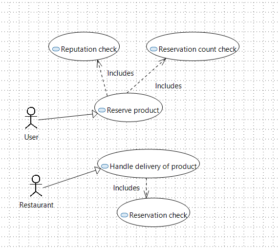
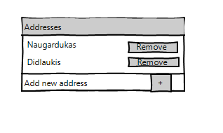
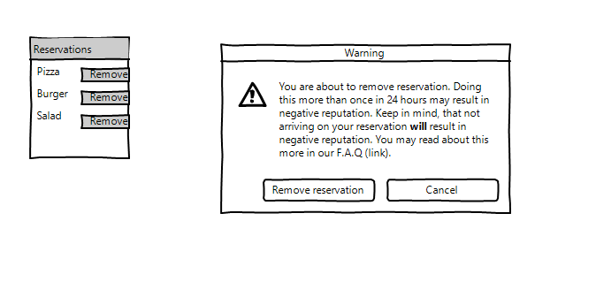

---
papersize:
- a4
fontsize:
- 12pt
geometry:
- margin=1in
fontfamily:
- charter
header-includes:
- \setlength\parindent{24pt}
---

\setcounter{page}{1}
\pagenumbering{arabic}
\begin{titlepage}
   \begin{center}
       \vspace*{1cm}

       \textbf{Food Waste}

       \vspace{1.5cm}

       \textbf{Arentas Meinorius,\\Jaunius Tamulevičius,\\Martinas Mačernius,\\Pijus Petkevičius}

       \vfill

       \vspace{0.8cm}

       Matematikos ir informatikos fakultetas\\
       Vilniaus universitetas\\
       Lietuva\\
       \today

   \end{center}
\end{titlepage}

# Summary {.unlisted .unnumbered}
&nbsp;&nbsp;&nbsp;&nbsp;The primary objective of the second laboratory assignment is to design the system and required changes. While in the first laboratory work we analysed business and all its processes, this time the attention on existing system and the changes. \

**The main tasks of this iteration:** \
   1. Domain model. \
   2. Use cases. \
   3. Sketches. \
\clearpage
\tableofcontents
\clearpage

# Context
For a system to be successful, it must be developed with the intention of solving a real-world problem, which, in our case, is reducing food waste in restaurants and shops. The software is useless if it does not solve required problem. In this part we analyse our problem and how it is intended to be solved. 

## Goal of the system
Reduce food waste by distributing it.

### The problem
Not all food products are sold before spoiling, sometimes restaurants do not use all the food they have bought.

### Solution
Prepare a plaftorm that would stand as a middle man helping people sell excess food while  allowing others to buy it cheaper.

## Planned changes
To further develop and increase the functionality of the existing system we created several tasks:

User registers to the platform and creates Restaurant account. User can have multiple restaurants (restaurant group). They can be added or removed when the user creates or edits profile data. When food product is added for the restaurant, user can choose one or more restaurants.

Every food Product has an allergens list. The list can be changed when the product is added or modified.

User can have Reservations of food products. Payment information is provided with the reservation.

User can have its favourite restaurants. In the page of a physical restaurant the user subscribes to the restaurant and its added to the favourite retaurans listm. The notifications are sent whenever the new products are added to the FoodWaste system favourite restaurant. User can also get notifications when an individual product is favoured.

### Change list
 + Restaurant might have multiple addresses.\
 + Remove reservation.\
 + Allergens tags on food products.\
 + Notifications for selected restaurants (whenever they add a new product)

\clearpage

### Domain model

### Glossary

### UI sketches

### Use case models

1. Multiple addresses for restaurant.

Main scenario (adding new address):
Administrator of the restaurant presses account bubble in the top right corner of the main screen. Multiple options show up in a list. Administrator presses “Account settings”. Settings screen contains “Addresses” subsection. User clicks green “Add new address” button. User inputs the address and presses save. System calls Google API to find the address. If the address is found - green “Address added” modal shows up in top right corner. User profile shows multiple addresses (including the new one) under “Addresses” subsection.

Alternative scenario:
If the address is not found on google maps – red “Address not found on google maps” modal shows up in the top right corner. User profile shows old addresses under “Addresses” subsection.

Main scenario (removing one of the addresses):
Administrator navigates to “Addresses” subsection in profile settings (as described in adding new address scenario). User sees red crosses near each address. Hovering over red cross displays a tooltip “Remove this address". User presses the button. Confirmation modal shows up with "This will remove all listings of this address”. User proceeds with deletion. Address is removed as well as all listings associated with it. Green modal shows up in top right corner signaling “Address removed successfully”

Alternative scenario:
Address is the last one – red cross is grayed out. Hovering over the button displays tooltip “Cannot remove the last address”.

2. Removing reservations
Main scenario:
User clicks on “My reservations”. New page with the list of reservations is loaded. Red crosses are displayed over each one. Hovering over red cross displays tooltip “You may cancel this reservation”. User clicks the button. Modal warning window pops up with the text “You are about to remove reservation. Doing this more than once in 24hours may result in negative reputation (keep in mind, that not arriving on your reservation *will* result in negative reputation). You may read about this more in our F.A.Q (link). Do you want to remove reservation?”.  User presses cancel and same reservations page is displayed.

Alternative scenario:
User confirms reservation removal. Reservation is removed from the list. In the top right corner green modal pop up displays “Reservation removed successfully”. System displays reservations page without canceled reservation.

3.Allergen list for sold products

Diagram:

3.1 Update personal allergen list
Main scenario: A logged-in user clicks the profile button in the top right corner. The system displays a drop-down menu from the button in the same page. The user clicks the “Personal allergens“ button. The system shows a new page with a list of his allergens. The user clicks “Add new“ button above the list. The system removes the “Add new“ button.  The system adds a drop-down list to the top of the allergen list and a deactivated “select“ button in the same page. The user clicks on the drop-down list and scrolls down it until he finds the substance he is allergic to and clicks on it. The system shows the selected allergen in place of the drop-down list and enables the “Select“ button. The user clicks the “Select“ button. The system instantly adds the allergen into the list of allergens in the shown page, deactivates the “Select“ button and show a check mark next to the “Select“ button.

Alternative scenario (when user is searching for his allergen in the drop-down list): The user writes down the allergen at the top of the drop-down list. The system updates the list with entered allergens. The clicks on the allergen. The scenario continues as written in the main scenario.

Alternative scenario: The logged-in user clicks on the “Foodwaste“ button at the top left corner of the page. The system shows the user the main page with a list of available products. The user clicks on a product. The system loads a new page with a detailed description of the product. The user clicks on a tab under the picture of the product called “Allergens“. The systems shows a list of allergens under the picture of the product with a “I’m allergic to this“ button next to each one. The user clicks a button “I’m allergic to this“ next to a substance he is allergic to. The system adds this allergen to the users list of allergens. 

Sketches:

3.2 View relevant allergens in the product
Main scenario: The logged-in user clicks on the “Foodwaste“ button at the top left corner of the page. The system shows the user the main page with a list of available products. The user clicks on a product that has his allergens. The system loads a new page with a detailed description of the product. The system shows a text box to the right product picture and bellow “Add to cart“ button with text box, saying “This product has substances that you are allergic to and is dangerous for you to consume“.

Alternative scenario (when user is in the detailed description of the product page): The user clicks on a tab under the picture of the product called “Allergens“. The systems shows a list of allergens under the picture of the product with a “I’m allergic to this“ button next to each one that is not present In users list of allergens and a red text box next to allergens that are in the users list of allergens, saying “Dangerous to you!“.

Alternative scenario (if user selects a product that has no substances that are dangerous to him in his list of allergens): The system loads a new page with a detailed description of the product. The system shows a text box to the right product picture and bellow “Add to cart“ button with text box, saying “This is safe to consume for you based on the information you have given to us“.

Alternative scenario (if user selects a product that has no substances that are dangerous to him in his list of allergens but sees something in the list of allergens that he is allergic to but has not recorded in his list of allergens): The system loads a new page with a detailed description of the product. The system shows a text box to the right product picture and bellow “Add to cart“ button with text box, saying “This is safe to consume based on the information you have given to us“. The user clicks on a tab under the picture of the product called “Allergens“. The systems shows a list of allergens under the picture of the product with a “I’m allergic to this“ button next to each one. The user clicks a button “I’m allergic to this“ next to a substance he is allergic to. The system adds this allergen to the users list of allergens. The system replaces “I’m allergic to this“ button with a “Dangerous to you!“. text box. The system updates the text box to the right product picture and bellow “Add to cart“ button with text, saying “This product has substances that you are allergic to and is dangerous for you to consume“.

Sketches:

3.3 View list of allergens in the product
Main scenario: Unregistered user clicks on the “Foodwaste“ button at the top left corner of the page. The system shows the user the main page with a list of available products. The user clicks on a product. The system loads a new page with a detailed description of the product. The user clicks on a tab under the picture of the product called “Allergens“. The systems shows a list of allergens under the picture of the product.

Alternative scenario (a logged-in user that has no records of his allergies clicks on a product): The system loads a new page with a detailed description of the product. The user clicks on a tab under the picture of the product called “Allergens“. The systems shows a list of allergens under the picture of the product with a “I’m allergic to this“ button next to each one.

Sketches:

4. Notifications for chosen restaurants

Diagram:

4.1 Favour a product
Main scenario: The logged-in user clicks on the “Foodwaste“ button at the top left corner of the page. The system shows the user the main page with a list of available products. The user clicks on a product. The system loads a new page with a detailed description of the product. The system shows a “Favour this“ button to the right of the product picture and above the “Add to cart“ button. User clicks on “Favour this“ button. The system adds this product to the list of users favoured products. The system updates the “Favour this“ button to a “Favoured“ button.

Alternative scenario (User favours a product from the product menu without entering the page with detailed information): The logged-in user clicks on the “Foodwaste“ button at the top left corner of the page. The system shows the user the main page with a list of available products. The user clicks on a button with an ellipsis symbol to the right side of the product. System displays a drop down menu from that button. The user clicks “Favour product“ button from the drop down menu. The system adds this product to the list of users favoured products. The system replaces the ellipsis symbol in the menu with a check mark symbol.

Sketches:

4.2 Favour a restaurant
Main scenario: The logged-in user clicks on the “Foodwaste“ button at the top left corner of the page. The system shows the user the main page with a list of available products. The user clicks on a product. The system loads a new page with a detailed description of the product. The user clicks on a tab under the picture of the product called “Restaurant“. The system updates the text box bellow the tab with information about the restaurant and a “Favour restaurant“ button on the top right corner of the text box. The user clicks the “Favour restaurant“ button. The system adds the favoured restaurant to the users favoured restaurants list. The system replaces the “Favour restaurant“ button with a “Favoured restaurant“ button.

Alternative scenario: (User favours a restaurant from the product menu without entering the page with detailed information): The logged-in user clicks on the “Foodwaste“ button at the top left corner of the page. The system shows the user the main page with a list of available products. The user clicks on a button with an ellipsis symbol to the right side of the product. System displays a drop down menu from that button. The user clicks “Favour restaurant“ button from the drop down menu. The system adds this restaurant to the list of users favoured restaurants. The system replaces the ellipsis symbol in the menu with a check mark symbol.

Sketches:

4.3 View favoured restaurants
Main scenario: A logged-in user clicks the profile button in the top tight corner. The system displays a drop-down menu from the button in the same page. The user clicks the “Favoured restaurants“ button. The system shows a new page with a list of all the restaurants the user has favoured.

Alternative scenario (user may look into a specific favoured restaurant with more depth from the favoured restaurants list): A user clicks on a restaurant. The system shows a new page with detailed information about the restaurants near the user and their offered products.

Sketches:

4.4 View all notifications
Main scenario: Restaurant updates their product selection. System updates the profile icon in the top right with a new icon with a blue point at the bottom of the profile icon. A logged-in user clicks the profile button in the top tight corner. The system displays a drop-down menu from the button in the same page. The system adds a blue point next to the “Notifications“ button. The user clicks the “Notifications“ button. The system shows a new page with a list of all the notifications from restaurants and products the user has favoured. The system adds a blue point to the left of all the new notifications.

Alternative scenario (The user may visit the page without any new notifications being present): A logged-in user clicks the profile button in the top tight corner. The system displays a drop-down menu from the button in the same page. The user clicks the “Notifications“ button. The system shows a new page with a list of all the notifications from restaurants and products the user has favoured.
Alternative scenario (The user may follow up on the notifications when in the Notifications page): The user clicks on a notification of a product. The system shows a new page that has the detailed description of the product. 

Sketches:

\clearpage

### GUI Sketches

#### Req. 1 - Several addresses for a restaurant

\clearpage

#### Req. 2 - Cancel reservation

\clearpage

#### Req. 3 - Alergen addition and warnings

\clearpage

\clearpage

#### Req. 4 - New product notification

# Impact of changes

## Multiple addresses for restaurant

### Analysis:

Restaurant chains like Talutti, Kfc, McDonalds have multiple restaurants. These restaurants will want to use single account for all activity on FoodWaste. Thus, multiple addresses for restaurant profiles are needed.

### Solution:

Each restaurant profile may have multiple addresses.

### Solution alternatives:

Do not provide this feature. Restaurants will have to create multiple accounts (one for each address)

### Problems:

Users might travel to one address instead of the correct one if addresses on products are not shown very clearly.

### Impact:

Restaurant entity will change.
Creating new offering will have a new choise (address, if multiple are provided)

## Removing reservations

### Analysis:

User plans might change and they might want to cancel reservation.

### Solution:

Each reservation may be canceled. Penalties will be applied if user continues to cancel multiple reservations.

### Solution alternatives:

Do not provide this feature. User will have to write a support ticket to remove reservation.
No penalties on cancelation.

### Problems:

Users might reserve things they will not come to pick up. Thus, penalties are introduced.

### Impact:

Reserved item might be returned to general selection if reservation is canceled.

## Allergen list for sold products

### Analysis:

Users have allergies. FoodWaste wants to inform users to not invoke alergic reactions.

### Solution:

Products will have list of allergens provided next to them.

### Solution alternatives:

Provide allergen filters (do not show dangerous products to user)
Do not provide this feature. User will have to contact restaurant to get this informatio.

### Problems:

Users might miss the allergen list.
Restaurants might provide information incorrectly.

### Impact:

Product entity will be changes.
Restaurants will have to fill more information on new product.

## Notifications for chosen restaurants.

### Analysis:

Users might be interested on specific restaurants (close to them, their favourites etc.)

### Solution:

Provide marking restaurants as favoured and send notifications on their new listings.

### Solution alternatives:

Provide email notifications/ send message trough SMS instead of app notifications.
Do not provide this feature. Users will have to check main offering lists to see if anything new is added.

### Problems:

Users might stop using product list and just wait for their restaurants.

### Impact:

User entity will be changed.
Notification systems will have to be implemented.

# Project plan

