---
papersize:
- a4
fontsize:
- 12pt
geometry:
- margin=1in
fontfamily:
- charter
header-includes:
- \setlength\parindent{24pt}
---

\setcounter{page}{1}
\pagenumbering{arabic}
\begin{titlepage}
   \begin{center}
       \vspace*{1cm}

       \textbf{Food Waste}

       \vspace{1.5cm}

       \textbf{Arentas Meinorius,\\Jaunius Tamulevičius,\\Martinas Mačernius,\\Pijus Petkevičius}

       \vfill

       \vspace{0.8cm}

       Matematikos ir informatikos fakultetas\\
       Vilniaus universitetas\\
       Lietuva\\
       \today

   \end{center}
\end{titlepage}

# Summary {.unlisted .unnumbered}
&nbsp;&nbsp;&nbsp;&nbsp;The primary objective of the second laboratory assignment is to design the system and required changes. While in the first laboratory work we analysed business and all its processes, this time the attention on existing system and the changes. \

**The main tasks of this iteration:** \
   1. Domain model. \
   2. Use cases. \
   3. Sketches. \
\clearpage
\tableofcontents
\clearpage

# Context
For a system to be successful, it must be developed with the intention of solving a real-world problem, which, in our case, is reducing food waste in restaurants and shops. The software is useless if it does not solve required problem. In this part we analyse our problem and how it is intended to be solved. 

## Goal of the system
Reduce food waste by distributing it.

### The problem
Not all food products are sold before spoiling, sometimes restaurants do not use all the food they have bought.

### Solution
Prepare a plaftorm that would stand as a middle man helping people sell excess food while  allowing others to buy it cheaper.

## Planned changes
To further develop and increase the functionality of the existing system we created several tasks:

User registers to the platform and creates Restaurant account. User can have multiple restaurants (restaurant group). They can be added or removed when the user creates or edits profile data. When food product is added for the restaurant, user can choose one or more restaurants.

Every food Product has an allergens list. The list can be changed when the product is added or modified.

User can have Reservations of food products. Payment information is provided with the reservation.

User can have its favourite restaurants. In the page of a physical restaurant the user subscribes to the restaurant and its added to the favourite retaurans listm. The notifications are sent whenever the new products are added to the FoodWaste system favourite restaurant. User can also get notifications when an individual product is favoured.

### Change list
 + Restaurant might have multiple addresses.\
 + Remove reservation.\
 + Allergens tags on food products.\
 + Notifications for selected restaurants (whenever they add a new product)

\clearpage

### Domain model

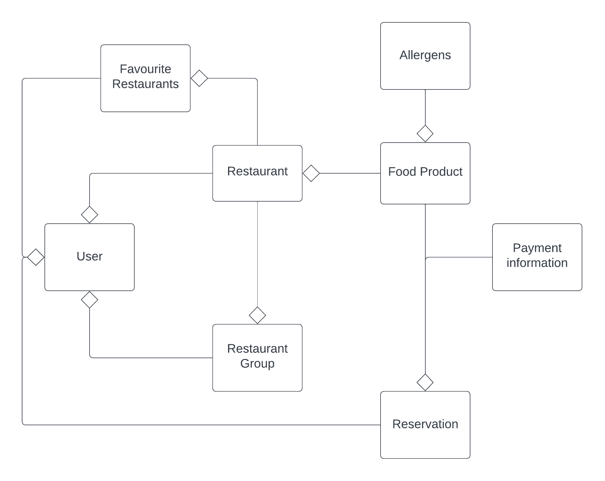

### Glossary

* Allergen: a ingredient that is certain people are allergic to.

* Favourite food product group: A group of food products that are added to the user favourite list.

* Favourite restaurant group: A group of restaurants that are added to the user favourite list.

* Food product: A product that is sold in the restaurant.

* Notification: A message that is sent to the user when a new product is added to the favourite restaurant group or the favoured food product changes.

* Payment information: A payment information that is provided with the reservation.

* Reserved item: A product that is reserved for the user.

* Restaurant: A place where food is sold.

* Restaurant Group: a group of restaurants that are added to the restaurant account.

* User: A person who uses the FoodWaste system. 

### UI sketches

### Use case models

1. Multiple addresses for restaurant.

Main scenario (adding new address):
Administrator of the restaurant presses account bubble in the top right corner of the main screen. Multiple options show up in a list. Administrator presses “Account settings”. Settings screen contains “Addresses” subsection. User clicks green “Add new address” button. User inputs the address and presses save. System calls Google API to find the address. If the address is found - green “Address added” modal shows up in top right corner. User profile shows multiple addresses (including the new one) under “Addresses” subsection.

Alternative scenario:
If the address is not found on google maps – red “Address not found on google maps” modal shows up in the top right corner. User profile shows old addresses under “Addresses” subsection.

Main scenario (removing one of the addresses):
Administrator navigates to “Addresses” subsection in profile settings (as described in adding new address scenario). User sees red crosses near each address. Hovering over red cross displays a tooltip “Remove this address". User presses the button. Confirmation modal shows up with "This will remove all listings of this address”. User proceeds with deletion. Address is removed as well as all listings associated with it. Green modal shows up in top right corner signaling “Address removed successfully”

Alternative scenario:
Address is the last one – red cross is grayed out. Hovering over the button displays tooltip “Cannot remove the last address”.

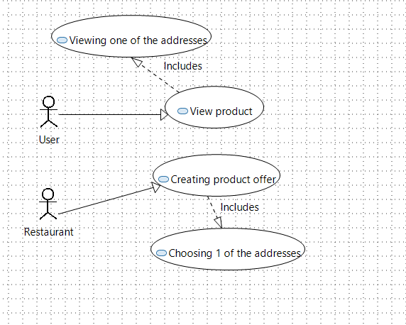

\clearpage
2. Remove reservations

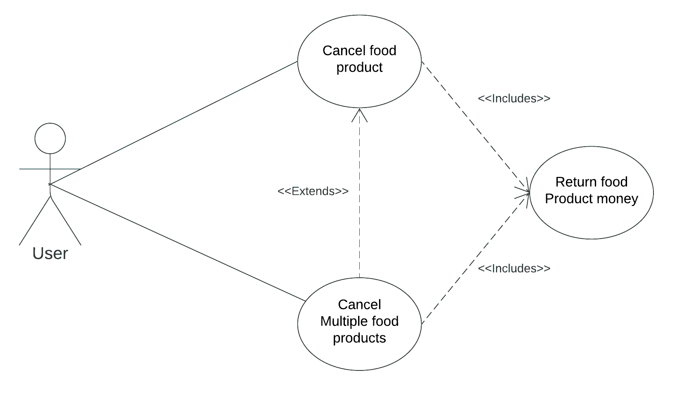
\clearpage
2.1. Removing one reservation

Main scenario: In the main page the user presses shopping cart icon on the top right. The systems opens users shopping cart page which contains reserved items and shows them in a list. The user selects one food product which he wants to remove from reservation. The system show modal dialog window which asks whether the user really wants to remove this food product from the reservation and contains 2 buttons: "no" and "yes". The user clicks "yes". The system removes item from the reservation list, returns partial sum of the product price and reloads the shopping cart page.

Alternative scenario 3: In the shopping cart page the user presses the cancel reservation button and in the modal confirmation window clicks "yes". The system shows error message that reservation cannot be removed because it is too late to remove it.

Alternative scenario 1: In the food product list the user presses the the food product. The system opens individual food product page which contains food product details, reservation details and reservation checkbox. The user clicks the reservation checkbox and in the modal confirmation window clicks "yes". The system removes item from the reservation list, returns partial sum of the product price and returns to the food product list.

Alternative scenario 2: In the individual food product page the user presses the cancel reservation button and in the modal confirmation window clicks "yes". The system returns error message that reservation cannot be removed because it is past the reservation cancellation time.

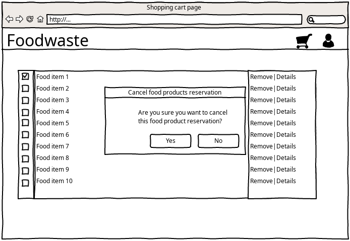
 
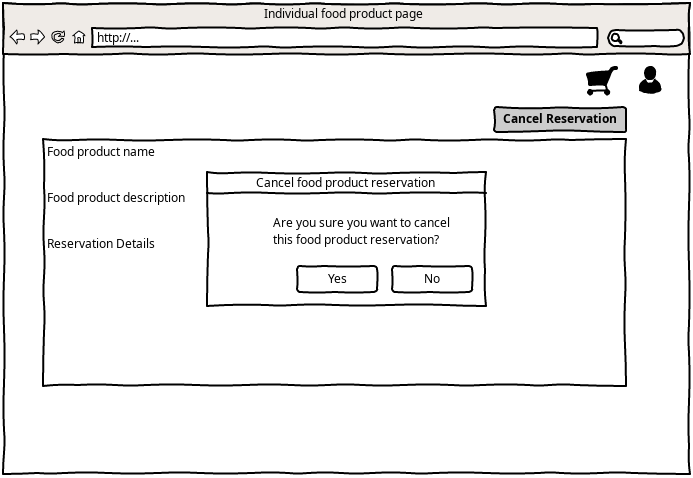
 
\clearpage
2.2. Removing multiple reservations

Main scenario: In the main page the user presses shopping cart icon on the top right. The systems opens users shopping cart page which contains reserved items and shows them in a list. The user selects multiple food products for which he wants to remove reservation. The system show modal dialog window which asks whether the user really wants to remove products from the reservation and contains 2 buttons: "no" and "yes". The user clicks "yes". The system removes food products from the list, returns partial sum of the products price and reloads the shopping cart page.

Alternative scenario 1: In the shopping cart page the user presses the reservation checkbox. The system shows modal dialog window which asks whether the user really wants to remove these food products from the reservation and contains 2 buttons: "no" and "yes". The user clicks "yes". The system returns error message that reservation cannot be removed because one or more food products are past the reservation cancellation time.

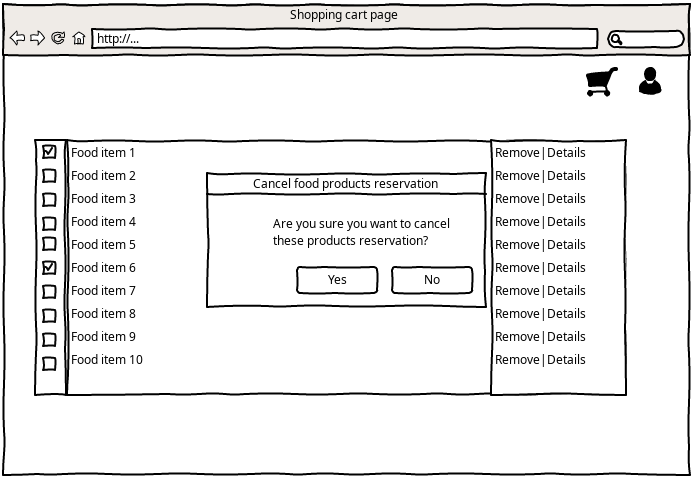

\clearpage

3.Allergen list for sold products

Main scenario: The user clicks on the profile tab. The user clicks the allergen subsection. The user selects allergens from a given list. The user clicks on „Save changes“ button. The user clicks on the restaurant tab. The user selects a restaurant. The user selects a product that has component that he has selected as his allergen. The system displays a warning box at the products description about the allergen.

Alternative scenario 1: The user clicks the button “Add to cart” button to add the product with his allergen. The system shows a pop-up dialogue warning the user that he wants to add a product that he is allergic to his cart. The user clicks “Do not put this in the cart” button. The system does not add the product to the user’s cart.

Alternative scenario 2: Unregistered user clicks on the restaurant tabs. The user selects a restaurant. The user clicks on a product. The user clicks on a tab named “Allergens”. The user checks if the list that is shown in the tab. The user finds an allergen that affects him. The user does not add the product in his cart.

Diagram:

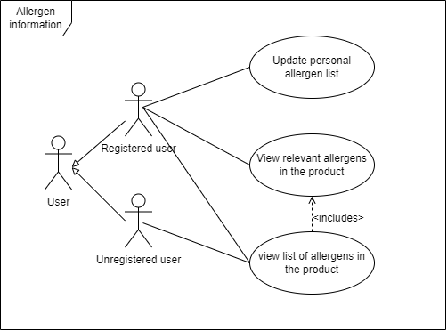

\clearpage

4. Notifications for chosen restaurants

Main scenario: In the page of a physical restaurant the user presses a crimson button with white text, saying "Favourite". The system adds this physical restaurant to the users list of favoured restaurants. The system reports successful subscription by making the button become white with ruby outline and text, saying "Favoured". The system shows the restaurant in the "Restaurant notifications" tab in "Favoured restaurants" page. The restaurant updates their food product information. The system sends the user a notification about the update. The user clicks "Restaurant notifications" tab to see updates from all their favoured restaurants or clicks on "Favoured restaurants" in this tab to see the list with their favoured restaurants that have been updated since last time they checked. Clicking a specific restaurant in "Favoured restaurants" page the user sees what exact products were added.

Alternative scenario: The user presses the “Restaurants” tab. The user clicks on a specific physical restaurant. The user presses a dark lilac button saying "Favourite". The system adds this product from this physical restaurant to the users list of favoured products. The system reports successful subscription by making the button become white with dark lavender outline and text, saying "Favoured". When this specific product can be purchased from this store the user is notified.

Diagram:

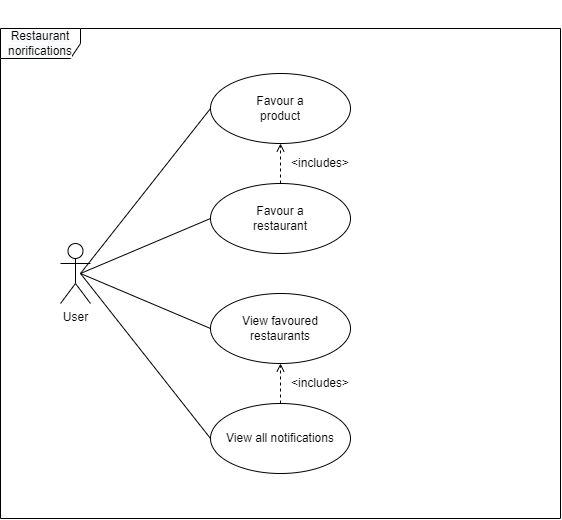

\clearpage

### GUI Sketches

#### Req. 3 - Alergen addition and warnings

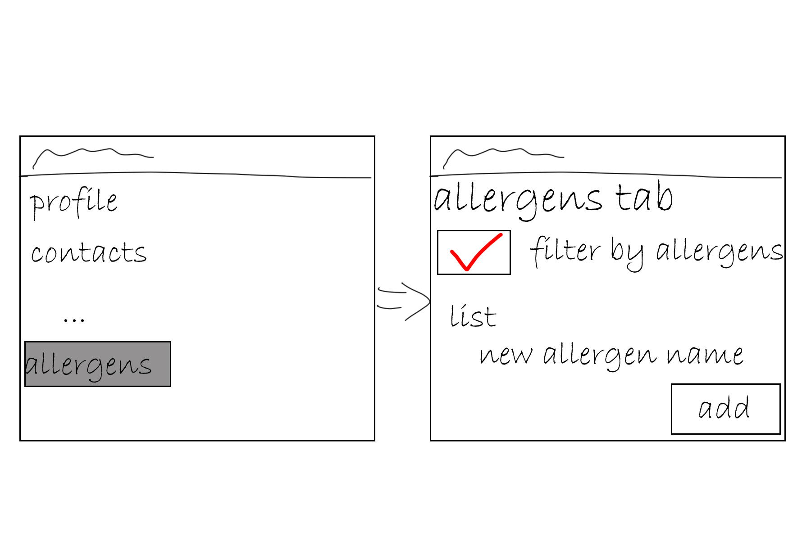

\clearpage

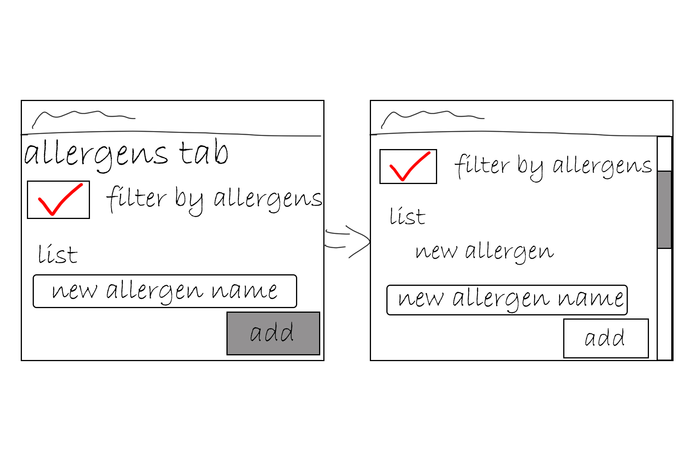

\clearpage

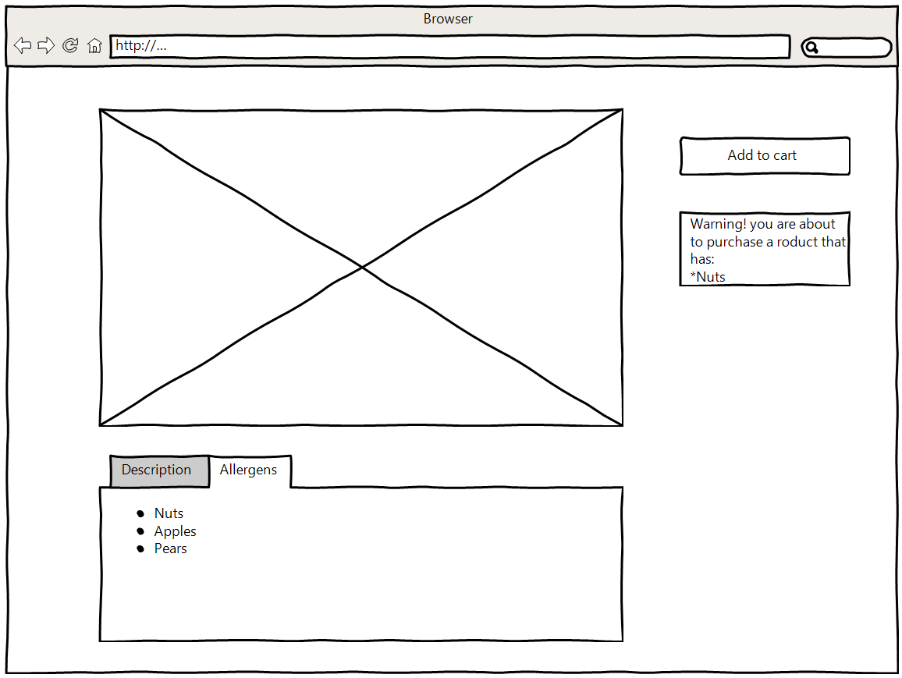

\clearpage

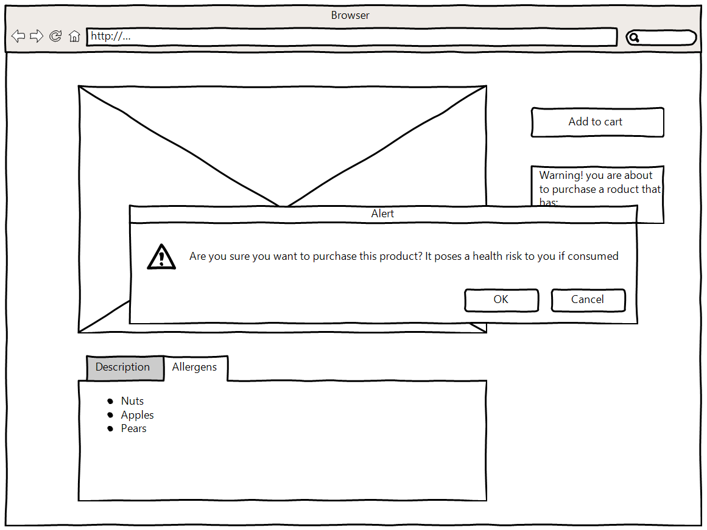

\clearpage

#### Req. 4 - New product notification

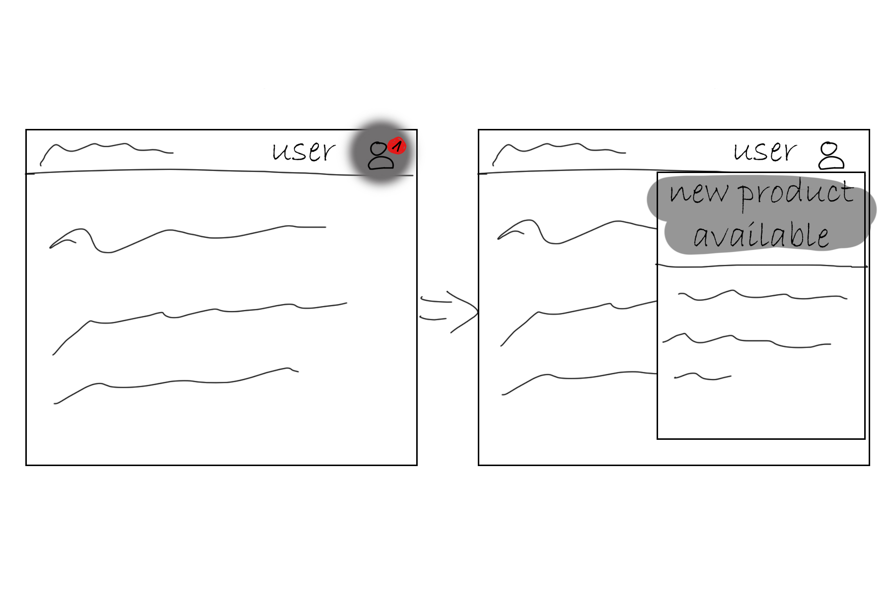

# Impact of changes

## Multiple addresses for restaurant

### Analysis:

Restaurant chains like Talutti, Kfc, McDonalds have multiple restaurants. These restaurants will want to use single account for all activity on FoodWaste. Thus, multiple addresses for restaurant profiles are needed.

### Solution:

Each restaurant profile may have multiple addresses.

### Solution alternatives:

Do not provide this feature. Restaurants will have to create multiple accounts (one for each address)

### Problems:

Users might travel to one address instead of the correct one if addresses on products are not shown very clearly.

### Impact:

Restaurant entity will change.
Creating new offering will have a new choise (address, if multiple are provided)

## Removing reservations

### Analysis:

User plans might change and they might want to cancel reservation.

### Solution:

Each reservation may be canceled. Penalties will be applied if user continues to cancel multiple reservations.

### Solution alternatives:

Do not provide this feature. User will have to write a support ticket to remove reservation.
No penalties on cancelation.

### Problems:

Users might reserve things they will not come to pick up. Thus, penalties are introduced.

### Impact:

Reserved item might be returned to general selection if reservation is canceled.

## Allergen list for sold products

### Analysis:

Users have allergies. FoodWaste wants to inform users to not invoke alergic reactions.

### Solution:

Products will have list of allergens provided next to them.

### Solution alternatives:

Provide allergen filters (do not show dangerous products to user)
Do not provide this feature. User will have to contact restaurant to get this informatio.

### Problems:

Users might miss the allergen list.
Restaurants might provide information incorrectly.

### Impact:

Product entity will be changes.
Restaurants will have to fill more information on new product.

## Notifications for chosen restaurants.

### Analysis:

Users might be interested on specific restaurants (close to them, their favourites etc.)

### Solution:

Provide marking restaurants as favoured and send notifications on their new listings.

### Solution alternatives:

Provide email notifications/ send message trough SMS instead of app notifications.
Do not provide this feature. Users will have to check main offering lists to see if anything new is added.

### Problems:

Users might stop using product list and just wait for their restaurants.

### Impact:

User entity will be changed.
Notification systems will have to be implemented.

# Project plan

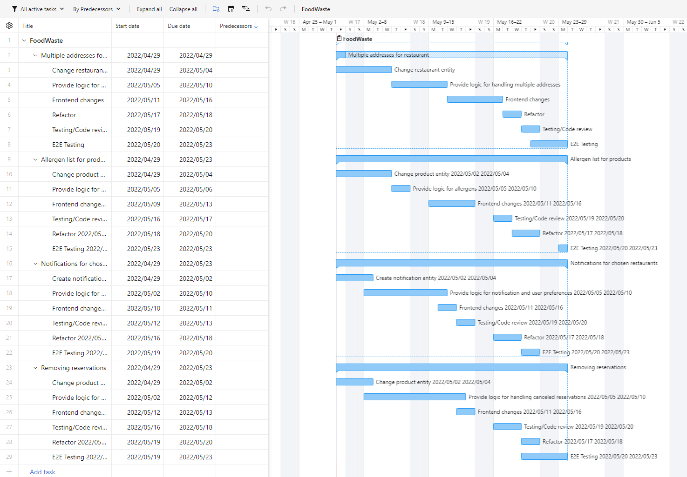