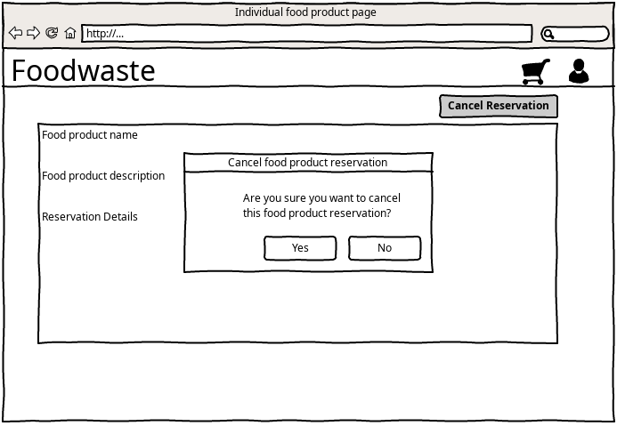
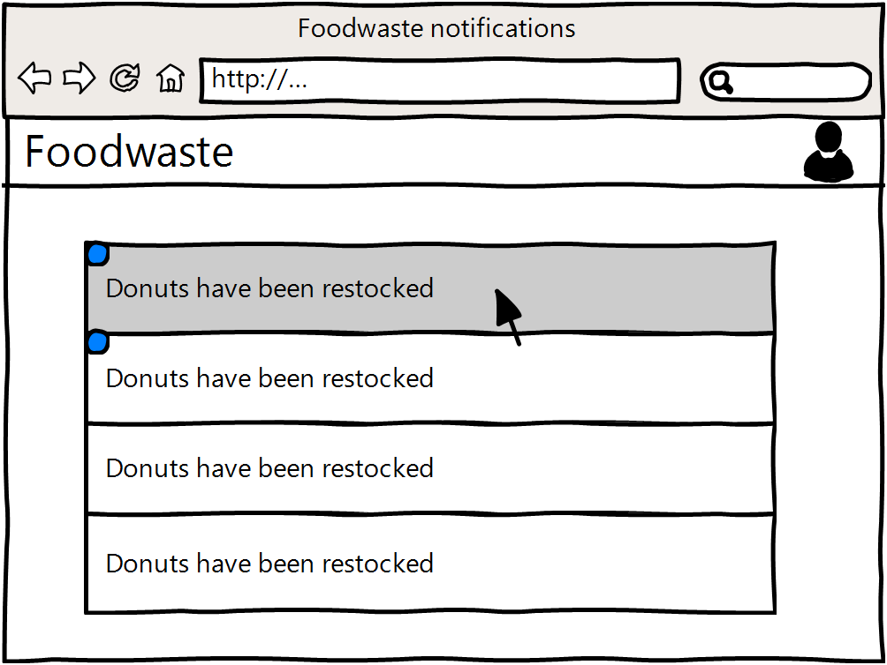

---
papersize:
- a4
fontsize:
- 12pt
geometry:
- margin=1in
fontfamily:
- charter
header-includes:
- \setlength\parindent{24pt}
---

\setcounter{page}{1}
\pagenumbering{arabic}
\begin{titlepage}
   \begin{center}
       \vspace*{1cm}

       \textbf{Food Waste}

       \vspace{1.5cm}

       \textbf{Arentas Meinorius,\\Jaunius Tamulevičius,\\Martinas Mačernius,\\Pijus Petkevičius}

       \vfill

       \vspace{0.8cm}

       Matematikos ir informatikos fakultetas\\
       Vilniaus universitetas\\
       Lietuva\\
       \today

   \end{center}
\end{titlepage}

# Summary {.unlisted .unnumbered}
&nbsp;&nbsp;&nbsp;&nbsp;The primary objective of the second laboratory assignment is to design the system and required changes. While in the first laboratory work we analysed business and all its processes, this time the attention on existing system and the changes. \

**The main tasks of this iteration:** \
   1. Class diagram \
   2. Use cases \
   3. Sketches \
   4. Planning of workflow \
   5. Impact analysis 
\clearpage
\tableofcontents
\clearpage

# Context
For a system to be successful, it must be developed with the intention of solving a real-world problem, which, in our case, is reducing food waste in restaurants and shops. The software is useless if it does not solve required problem. In this part we analyse our problem and how it is intended to be solved. 

## Goal of the system
Reduce food waste by distributing it.

### The problem
Not all food products are sold before spoiling, sometimes restaurants do not use all the food they have bought.

### Solution
Prepare a plaftorm that would stand as a middle man helping people sell excess food while  allowing others to buy it cheaper.

## Planned changes
To further develop and increase the functionality of the existing system we created several tasks:

User registers to the platform and creates Restaurant account. User can have multiple restaurants (restaurant group). They can be added or removed when the user creates or edits profile data. When food product is added for the restaurant, user can choose one or more restaurants.

Every food Product has an allergens list. The list can be changed when the product is added or modified.

User can have Reservations of food products. Payment information is provided with the reservation.

User can have its favourite restaurants. In the page of a physical restaurant the user subscribes to the restaurant and its added to the favourite retaurans listm. The notifications are sent whenever the new products are added to the FoodWaste system favourite restaurant. User can also get notifications when an individual product is favoured.

### Change list
 + Restaurant might have multiple addresses.\
 + Remove reservation.\
 + Allergens tags on food products.\
 + Notifications for selected restaurants (whenever they add a new product)

# Domain model

\clearpage

# Class diagram

\clearpage

# Glossary

* Allergen: a ingredient that is certain people are allergic to.

* Favourite food product group: A group of food products that are added to the user favourite list.

* Favourite restaurant group: A group of restaurants that are added to the user favourite list.

* Food product: A product that is sold in the restaurant(for our platform it is a product that is going to expire soon).

* Notification: A message that is sent to the user when a new product is added to the favourite restaurant group or the favoured food product changes.

* Payment information: A payment information that is provided with the reservation.

* Reserved item: A product that is reserved for the user.

* Restaurant: A place where food is sold(for our platform restaurants provide a list of food products that will soon expire).

* Restaurant Group: a group of restaurants that are added to the restaurant account.

* User: A person who uses the FoodWaste system. 

\clearpage

# Use case models

## Multiple addresses for a restaurant

### Manage restaurant addresses

   

   Main scenario: 
   Restaurant presses account bubble in website header. System loads restaurant information (Address, name, phone number) and opens restaurant editing page. System shows address table. Address has a remove button next to it. Restaurant inputs new address in the address table. System finds the address with Google API and highlights a plus button with green color. User presses the plus button. System updates the address table.

   Alt. 1: If system doesn't find the address, system highlights a plus button with red color and disables it.

   Alt. 2: If the address is already entered, system highlights a plus button with red color and disables it.

   Alt. 3: If restaurant presses remove button, system disables products that only have this address and removes address from the table.

   Alt. 4: If only one address is in the table, System disables remove button

   Disable product is an important process that has it's own logic and requires separate use case but that's out of scope for our current iteration and will be taken into consideration in later stages.

   

   \clearpage

   Robustness diagram:
   
   

\clearpage

## Remove reservations

\clearpage
### Cancel reservation

Main scenario: In the main page the user presses shopping cart icon on the top right. The systems opens users shopping cart page which contains reserved items and shows them in a list. The user selects one food product which he wants to remove from reservation. The system show modal dialog window which asks whether the user really wants to remove this food product from the reservation and contains 2 buttons: "no" and "yes". The user clicks "yes". The system removes item from the reservation list, returns partial sum of the product price and reloads the shopping cart page.

Alternative scenario 1: In the shopping cart page the user presses the cancel reservation button and in the modal confirmation window clicks "yes". The system shows error message that reservation cannot be removed because it is past the reservation cancellation time.

Alternative scenario 2: In the food product list the user presses the the food product. The system opens individual food product page which contains food product details, reservation details and reservation checkbox. The user clicks the reservation checkbox and in the modal confirmation window clicks "yes". The system removes item from the reservation list, returns partial sum of the product price and returns to the food product list.

Alternative scenario 3: In the individual food product page the user presses the cancel reservation button and in the modal confirmation window clicks "yes". The system returns error message that reservation cannot be removed because it is past the reservation cancellation time.

Alternative scenario 4: In the shopping cart page the user select multiple food products, presses the cancel reservation button and in the modal confirmation window clicks "yes". The system removes items from the reservation list, returns partial sum of the product price and reloads the shopping cart page.

Alternative scenario 5: In the shopping cart page the user select multiple food products, presses the cancel reservation button and in the modal confirmation window clicks "yes". The system shows error message that reservation cannot be removed because it is past the reservation cancellation time.

 

 
\clearpage

Robustness diagram:

\clearpage

## Allergen list for sold food products

Diagram:

### Add a new allergen to the users allergen list

Main scenario: A logged-in user clicks the profile button in the top right corner. The system displays a drop-down menu from the button in the same page. The user clicks the “Personal allergens“ button. The system shows a new page with a list of his allergens. The user clicks “Add new“ button above the list. The system removes the “Add new“ button.  The system adds a drop-down list to the top of the allergen list and a deactivated “select“ button in the same page. The user clicks on the drop-down list and scrolls down it until he finds the allergen and clicks on it. The system shows the selected allergen in place of the drop-down list and enables the “Select“ button. The user clicks the “Select“ button. The system instantly adds the allergen into the list of allergens in the shown page, deactivates the “Select“ button and show a check mark next to the “Select“ button.

\clearpage

Alternative scenario (when user is searching for his allergen in the drop-down list): The user writes down the allergen at the top of the drop-down list. The system updates the list with entered allergens. The clicks on the allergen. The scenario continues as written in the main scenario.

\clearpage

Alternative scenario: The logged-in user clicks on the “Foodwaste“ button at the top left corner of the page. The system shows the user the main page with a list of available food products. The user clicks on a food product. The system loads a new page with a detailed description of the food product. The user clicks on a tab under the picture of the food product called “Allergens“. The systems shows a list of allergens under the picture of the food product with a “I’m allergic to this“ button next to each one. The user clicks a button “I’m allergic to this“ next to the allergen. The system adds this allergen to the users list of allergens. 

\clearpage

Robustness diagram:

\clearpage

### View relevant allergens in the food product

Main scenario: The logged-in user clicks on the “Foodwaste“ button at the top left corner of the page. The system shows the user the main page with a list of available food products. The user clicks on a food product that has his allergens. The system loads a new page with a detailed description of the food product. The system shows a text box to the right of the food product picture and bellow “Add to cart“ button with text box, saying “This product has substances that you are allergic to and is dangerous for you to consume“.

\clearpage

Alternative scenario (when user is in the detailed description of the food product page): The user clicks on a tab under the picture of the food product called “Allergens“. The systems shows a list of allergens under the picture of the food product with a “I’m allergic to this“ button next to each one that is not present In users list of allergens and a red text box next to allergens that are in the users list of allergens, saying “Dangerous to you!“.

\clearpage

Alternative scenario (if user selects a food product that has no allergens that he has declared in his allergen list): The system loads a new page with a detailed description of the food product. The system shows a text box to the right food product picture and bellow “Add to cart“ button with text box, saying “This is safe to consume for you based on the information you have given to us“.

\clearpage

Alternative scenario (if user selects a food product that has no allergens that he has declared in his allergen list but sees something in the list of allergens that he is allergic to but has not recorded in his list of allergens): The system loads a new page with a detailed description of the food product. The system shows a text box to the right food product picture and bellow “Add to cart“ button with text box, saying “This is safe to consume based on the information you have given to us“. The user clicks on a tab under the picture of the food product called “Allergens“. The systems shows a list of allergens under the picture of the food product with a “I’m allergic to this“ button next to each one. The user clicks a button “I’m allergic to this“ next to the allergen. The system adds this allergen to the users list of allergens. The system replaces “I’m allergic to this“ button with a “Dangerous to you!“. text box. The system updates the text box to the right of the food product picture and bellow “Add to cart“ button with text, saying “This product has substances that you are allergic to and is dangerous for you to consume“.

\clearpage

Robustness diagram:

\clearpage

### View list of allergens in the food product

Main scenario: Unregistered user clicks on the “Foodwaste“ button at the top left corner of the page. The system shows the user the main page with a list of available food products. The user clicks on a food product. The system loads a new page with a detailed description of the food product. The user clicks on a tab under the picture of the food product called “Allergens“. The systems shows a list of allergens under the picture of the food product.

\clearpage

Alternative scenario (a logged-in user that has no records of his allergies clicks on a food product): The system loads a new page with a detailed description of the food product. The user clicks on a tab under the picture of the food product called “Allergens“. The systems shows a list of allergens under the picture of the food product with a “I’m allergic to this“ button next to each one.

\clearpage

Robustness diagram:

\clearpage

## Notifications for chosen restaurants

Diagram:

### Favour a food product

Main scenario: The logged-in user clicks on the “Foodwaste“ button at the top left corner of the page. The system shows the user the main page with a list of available food products. The user clicks on a food product. The system loads a new page with a detailed description of the food product. The system shows a “Favour this“ button to the right of the food product picture and above the “Add to cart“ button. User clicks on “Favour this“ button. The system adds this food product to the list of users favoured food products. The system updates the “Favour this“ button to a “Favoured“ button.

\clearpage

Alternative scenario (User favours a food product from the food product menu without entering the page with detailed information): The logged-in user clicks on the “Foodwaste“ button at the top left corner of the page. The system shows the user the main page with a list of available food products. The user clicks on a button with an ellipsis symbol to the right side of the food product. System displays a drop down menu from that button. The user clicks “Favour product“ button from the drop down menu. The system adds this food product to the list of users favoured food products. The system replaces the ellipsis symbol in the menu with a check mark symbol.

\clearpage

Robustness diagram:

\clearpage

### Favour a restaurant
Main scenario: The logged-in user clicks on the “Foodwaste“ button at the top left corner of the page. The system shows the user the main page with a list of available food products. The user clicks on a food product. The system loads a new page with a detailed description of the food product. The user clicks on a tab under the picture of the food product called “Restaurant“. The system updates the text box bellow the tab with information about the restaurant and a “Favour restaurant“ button on the top right corner of the text box. The user clicks the “Favour restaurant“ button. The system adds the favoured restaurant to the users favoured restaurants list. The system replaces the “Favour restaurant“ button with a “Favoured restaurant“ button.

\clearpage

Alternative scenario (User favours a restaurant from the food product menu without entering the page with detailed information): The logged-in user clicks on the “Foodwaste“ button at the top left corner of the page. The system shows the user the main page with a list of available food products. The user clicks on a button with an ellipsis symbol to the right side of the food product. System displays a drop-down menu from that button. The user clicks “Favour restaurant“ button from the drop down menu. The system adds this restaurant to the list of users favoured restaurants. The system replaces the ellipsis symbol in the menu with a check mark symbol.

\clearpage

Robustness diagram:

\clearpage

### View favoured restaurants

Main scenario: A logged-in user clicks the profile button in the top tight corner. The system displays a drop-down menu from the button in the same page. The user clicks the “Favoured restaurants“ button. The system shows a new page with a list of all the restaurants the user has favoured.

\clearpage

Alternative scenario (user may look into a specific favoured restaurant with more depth from the favoured restaurants list): A user clicks on a restaurant. The system shows a new page with detailed information about the restaurants near the user and their offered food products.

\clearpage

Robustness diagram:

\clearpage

### View all notifications

Main scenario: Restaurant updates their food product selection. System updates the profile icon in the top right with a new icon with a blue point at the bottom of the profile icon. A logged-in user clicks the profile button in the top tight corner. The system displays a drop-down menu from the button in the same page. The system adds a blue point next to the “Notifications“ button. The user clicks the “Notifications“ button. The system shows a new page with a list of all the notifications from restaurants and food products the user has favoured. The system adds a blue point to the left of all the new notifications.

\clearpage

Alternative scenario (The user may visit the page without any new notifications being present): A logged-in user clicks the profile button in the top tight corner. The system displays a drop-down menu from the button in the same page. The user clicks the “Notifications“ button. The system shows a new page with a list of all the notifications from restaurants and food products the user has favoured.

\clearpage

Alternative scenario (The user may follow up on the notifications when in the Notifications page): The user clicks on a notification of a food product. The system shows a new page that has the detailed description of the food product. 

\clearpage

Robustness diagram:

\clearpage

# Impact of changes

## Multiple addresses for restaurant

### Analysis:

Restaurant chains like Talutti, Kfc, McDonalds have multiple restaurants. These restaurants will want to use single account for all activity on FoodWaste. Thus, multiple addresses for restaurant profiles are needed.

### Solution:

Each restaurant profile may have multiple addresses.

### Solution alternatives:

Do not provide this feature. Restaurants will have to create multiple accounts (one for each address)

### Problems:

Users might travel to one address instead of the correct one if addresses on products are not shown very clearly.

### Impact:

Restaurant entity will change.
Creating new offering will have a new choise (address, if multiple are provided)

## Removing reservations

### Analysis:

User plans might change and they might want to cancel reservation.

### Solution:

Each reservation may be canceled. Penalties will be applied if user continues to cancel multiple reservations.

### Solution alternatives:

Do not provide this feature. User will have to write a support ticket to remove reservation.
No penalties on cancelation.

### Problems:

Users might reserve things they will not come to pick up. Thus, penalties are introduced.

### Impact:

Reserved item might be returned to general selection if reservation is canceled.

## Allergen list for sold products

### Analysis:

Users have allergies. FoodWaste wants to inform users to not invoke alergic reactions.

### Solution:

Products will have list of allergens provided next to them.

### Solution alternatives:

Provide allergen filters (do not show dangerous products to user)
Do not provide this feature. User will have to contact restaurant to get this informatio.

### Problems:

Users might miss the allergen list.
Restaurants might provide information incorrectly.

### Impact:

Product entity will be changes.
Restaurants will have to fill more information on new product.

## Notifications for chosen restaurants.

### Analysis:

Users might be interested on specific restaurants (close to them, their favourites etc.)

### Solution:

Provide marking restaurants as favoured and send notifications on their new listings.

### Solution alternatives:

Provide email notifications/ send message trough SMS instead of app notifications.
Do not provide this feature. Users will have to check main offering lists to see if anything new is added.

### Problems:

Users might stop using product list and just wait for their restaurants.

### Impact:

User entity will be changed.
Notification systems will have to be implemented.

\clearpage

# Project plan

\clearpage

# Traceability

## Requirements

R1 Restaurant might have multiple addresses \
R2 Remove reservation \
R3 Allergens tags on food products \ 
R4 Notifications for selected restaurants 

## Use cases

UC1 Manage multiple restaurant addresses \
UC2 Reservation cancellation \
UC3 Add a new allergen to the users allergen list \
UC4 View relevant allergens in the food product \
UC5 View list of allergens in the food product \
UC6 Favour a food product \
UC7 Favour a restaurant \
UC8 View favoured restaurants \
UC9 View all notifications 

