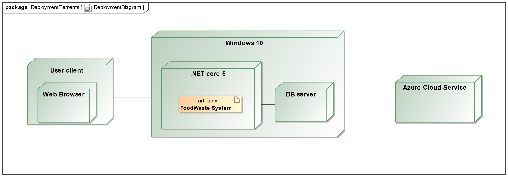

---
papersize:
- a4
fontsize:
- 12pt
geometry:
- margin=1in
fontfamily:
- charter
header-includes:
- \setlength\parindent{24pt}
---

\setcounter{page}{1}
\pagenumbering{arabic}
\begin{titlepage}
   \begin{center}
       \vspace*{1cm}

       \textbf{Food Waste}

       \vspace{1.5cm}

       \textbf{Arentas Meinorius,\\Jaunius Tamulevičius,\\Martinas Mačernius,\\Pijus Petkevičius}

       \vfill

       \vspace{0.8cm}

       Matematikos ir informatikos fakultetas\\
       Vilniaus universitetas\\
       Lietuva\\
       \today

   \end{center}
\end{titlepage}

# Summary {.unlisted .unnumbered}
&nbsp;&nbsp;&nbsp;&nbsp;The primary objective of the second laboratory assignment is to design the system and required changes. While in the first laboratory work we analysed business and all its processes, this time the attention on existing system and the changes. \

**The main tasks of this iteration:** \
   1. Allergens feature \
   2. E2E test \
   3. Document the E2E test \
   4. Viewpoints \
   5. Perspectives \
   6. Traceablity tables \
\clearpage
\tableofcontents
\clearpage

\clearpage
# Viewpoints

## Context viewpoint

- Allergens are properties of food products that are likely to cause unwanted reactions with allergic individuals.

    - All food offerings may contain a list of allergens that have to be set by the restaurant
    - All users may provide a list of allergens that are dangerous to them \

- System will use the user and product allergen information to:

    - Alert if user is trying reserve product that may be dangerous to the individual
    - Provide easy filtering of allergic products (in the future)

## Functional viewpoint

- Each restaurant will have an option to add allergens to products:

  1. While creating offers
  2. Anytime while offer is not reserved

- Each restaurant will have an option to remove allergens from offers anytime while products are not reserved
- Each user will be able to add allergens to their profile anytime

## Information viewpoint

- Allergen entity contains name, [Annex 2 name](https://ec.europa.eu/food/system/files/2018-07/codex_ccfl_cl-2018-24_ann-02.pdf), severity: [May contain, Contains]
- Product entity contains list of allergens
- User entity contains list of allergens that are dangerous to them

## Concurrency viewpoint

Not applicable. Allergens are properties, not processes that could happen concurrently.

## Development viewpoint

Allergen in FoodWaste system is not a major architectural component. Allergen lists are attached to major components such as product and user, however, they do not interfere with current usage of these entities and their functionality (except for the alert if trying to reserve allergic foods). In the future, it should be easy to implement allergen filtering on main page (for better user experience).

\clearpage

## Deployment viewpoint

### Runtime Platform Required

There are no system requirements for end users, because we are developing a web application. Since we used .NET Razor Pages framework, it is highly recommended to use Windows operating system in execution environment. 

### Specifications and Quantity of Hardware or Hosting Required

Due to our type of service we are going to need a server to host the website with sufficient amount of storage to store all the data locally. Server specifications are currently unknown we need a consultation from more knowledgeable hardware specialist. We are also going to leave some headroom for the hardware specifications to deal with heavy loads and future growth. We are getting Azure cloud service to backup our local data to protect against possible physical damage to server or in case of power outage

- Server components - TBD
- Server Memory - TBD

### Third-Party Software Requirements

Since we are using .NET core we are going to use available libraries to make our work easier
- Xunit 2.4.1
- PostgreSQL 5.0.0-rc2
- MatBlazor 2.8.0
- Coverlet.Collector 3.0.2

### Technology Compatibility

Due to .NET core used libraries should be backwards compatible but in case there are runtime error, we have provided version in previous segment

### Network Requirements

We are primarily going to use our local DB server to store data but we will want to backup the said data to Azure cloud, regular ISP speeds of 1 gigabit should be sufficient for the startup but we will want to upgrade down the road to support heavier client traffic.

### Network Capacity Required

Based on the recommendations for our local database server Azure cloud should be capable to handle the same amount of data (TBD)

### Physical Constraints

We don't have much physical constraints, we are going to need a small server and we are using cloud service for backup, so no need to rent remote area for backup database.
We might want to expand with this later, to have a remote server in case of emergency, to keep our services always running.

### Requirement specifics 

Allergens are properties, not major components that change the program environment or its execution. Deployment will not differ from other feature deployments (A/B testing in production environment for part of the users and if there are no incidents - major release).

## Operational viewpoint

- Users will provide their allergens when registering or anytime when using FoodWaste
- Users will be alerted if trying to reserve products they are allergic to
- Restaurants will have to provide allergen list for their current products and each time when creating new offers

\clearpage
