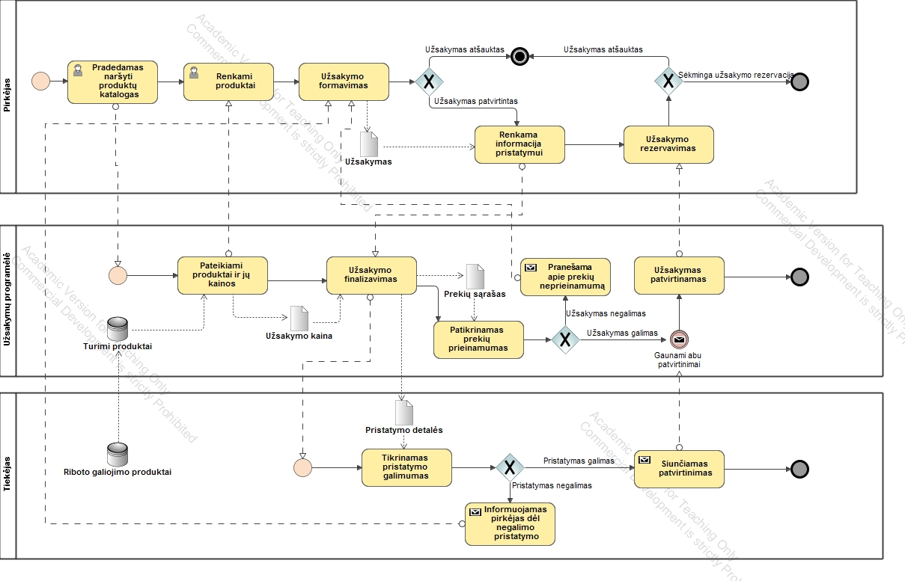

---
papersize:
- a4
fontsize:
- 12pt
geometry:
- margin=1in
fontfamily:
- charter
header-includes:
- \setlength\parindent{24pt}
---

\begin{titlepage}
   \begin{center}
       \vspace*{1cm}

       \textbf{Food Waste}

       \vspace{1.5cm}

       \textbf{Arentas Meinorius,\\Jaunius Tamulevičius,\\Martinas Mačernius,\\Pijus Petkevičius}

       \vfill
            
       \vspace{0.8cm}
            
       Matematikos ir informatikos fakultetas\\
       Vilniaus universitetas\\
       Lietuva\\
       \today
            
   \end{center}
\end{titlepage}

\tableofcontents
\pagenumbering{roman}
\clearpage
\pagenumbering{arabic}
\setcounter{page}{0}
# Išorinė analizė
## Vizija 
- Sumažinti išmetamo maisto kiekį jį išdalinant

## Misija 
- Suteikti galimybę lengvai pasiekti skanų, visavertį maistą, kuris būtų išmestas.

## Vartotojai
- Pardavėjai (parduotuvės, restoranai) - skelbtų galiojimo pabaigą greit pasieksiančių prekių sąrašą **Food Waste** platformoje
- Pirkėjai - žmonės, norintys tvariau/pigiau maitintis
 
## Partneriai
- Įvairūs restoranai (Gaspars, Drama burger, greitojo maisto restoranai - Hesburger, KFC ir pan.)
- Parduotuvės (Rimi, Iki, Maxima, Lidl ir pan.) 
- Wolt, Bolt food, Barbora- šios kompanijos galėtų tiekti užsakytą maistą pirkėjui namus (pasirenkamas variantas, kadangi norintys sutaupyti pasirinks nemokėti kurjeriams, o atkeliaus patys).

## Konkurentai
- Maisto bankas, kitos labdaros.
- Kadangi **Food Waste** ne pelno siekianti organizacija - bendradarbiavimas su 'konkurentais' turėtų būti apsvarstytas.

## Ribos
- Programa veiks Lietuvos mastu, bus pasiekiama interneto naršyklėje. Programėlės tikslas vartotojus tik informuoti apie pigesnius maisto produktus ar patiekalus, kurie kitaip būtų išmesti.
- Esant galimybei pristatymo integracija su kurjeriais (Bolt, Wolt)

## Remėjai
- Teiksime paraišką Europos Socialinio Fond Agentūrai (https://www.esf.lt/lt/kuo-mes-galime-padeti/noriu-gauti-esf-parama/12)[nuoroda]

## SWOT (kai gausime duombazę)
### Stiprybės  
- Veikiantis MVP

### Silpnybės  
- Šiuo metu mūsų infrastruktūra nėra pilnai išplėtota(neturime partnerių, tiekėjų).

### Galimybės  
- Mažai konkurentų

### Grėsmės  
- Ateityje tiekėjai gali atsisakyti mūsų produkto pakeisdami jį savo sukurtą produktą.

## Suinteresuotosios šalys ir jų poreikiai

### Užsakovai:
- Norimas funkcionalumas:
 - Pridėtas produktų pirkimas/nupirkto produkto statusas.
 - Restorano administratorius gali keisti įrašus.
 - Pridėti klientų aptarnavimo skiltį.
- Profesionalios įžvalgos sėkmingam projekto realizavimui užtikrinti.

### Darbuotojai:
- Atlyginimas.
- Aktyviai prisidedama prie švaresnės aplinkos.

### Savanoriai:
- Savanoriavimo valandos (ypač aktualu moksleiviams).
- Karmos taškai.

### Klientai:
- Teikiamas kokybiškas maistas.
- Išmetama mažiau maisto.
- Tausojama aplinka - tiek mažiau teršiant, tiek mažiau vartojant.
- Taupoma.

### Tiekėjai:
- Gaunamas pelnas iš produktų, kuriuos paprastai išmetant būtų tik nuostolis.
- Pasiekiama platesnė publika, labiau susidomėjusi ekologiškesnėmis alternatyvomis.
- Potencialiai mažinamos išlaidos užsakant naujus produktus.
- Gerinami viešieji ryšiai. (PR'as)

# Reikalavimai

## Funkciniai reikalavimai \
* Programa galima naudotis prisiregistravusiems ir neprisiregistravusiems vartotojams; 
* Programos vartotojams maisto produktų, priregistruotų sistemoje, sąrašas; \
* Renginių maisto produktų sąrašą galima filtruoti pagal: \
‒ abėcėliškai; \
‒ datą; \
‒ kainą; \
* Prisiregistravusiems vartotojams suteikiamos šios galimybės: \
‒ galimybė rezervuoti maisto produktus, nurodant visą reikalingą informaciją; \ 

* Pateikiama detali informaciją apie maisto produktą: \
‒ maisto produkto data; \
‒ maisto produkto kaina; \
* Administratoriams suteikiamas šis funkcionalumas: \
‒ skaityti informaciją apie parduotuves, maisto produktus ir vartotoją; \
‒ ištrinti parduotuves, maisto prekių parduotuves, redaguoti jų informaciją; \
‒ šalinti kitus vartotojus;\

## Nefunkciniai reikalavimai

* Saugumas \
‒ Apsaugos nuo SQL injekcijų. \
‒ Slaptažodis privalo atitikti saugumo reikalavimus (turi būti bent vienas skaitmuo, didžioji raidė ir bent 8 simboliai). \
* Naudojimas \
‒ Patogi ir aiški vartotojo sąsaja. \
‒ Vartotojai gali ieškoti maisto produktų vos įsijungę programėlę. \
‒ Vartotojo sąsaja nėra apkrauta, lengvai suprantama. \
* Patikimumas \
‒ 100% serverio veikimo laikas. \
‒ Greitas užklausų apdorojimas. \

# BPMN

