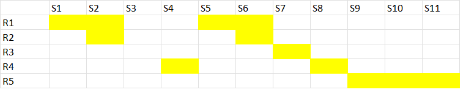

---
papersize:
- a4
fontsize:
- 12pt
geometry:
- margin=1in
fontfamily:
- charter
header-includes:
- \setlength\parindent{24pt}
---

\setcounter{page}{1}
\pagenumbering{arabic}
\begin{titlepage}
   \begin{center}
       \vspace*{1cm}

       \textbf{Food Waste}

       \vspace{1.5cm}

       \textbf{Arentas Meinorius,\\Jaunius Tamulevičius,\\Martinas Mačernius,\\Pijus Petkevičius}

       \vfill
            
       \vspace{0.8cm}
            
       Matematikos ir informatikos fakultetas\\
       Vilniaus universitetas\\
       Lietuva\\
       \today
            
   \end{center}
\end{titlepage}

\tableofcontents
\clearpage
# Kontekstas 
## Įžanga
 &nbsp;&nbsp;&nbsp;&nbsp; Šiuolaikiniame pasaulyje augant žmonių skaičiui, maisto poreikis stipriai auga. Kad patenkinti žmonių poreikius, statomos naujos maisto prekių parduotuvės,restoranai. Tačiau ne visas maistas yra parduodamas, dažnai yra nukainojamas, bet ne visada viskas būna išparduodama ir tenka likučius išmesti.
 Taip parduotuvės, restoranai patiria gana didelius nuostolius. Bet to būtų galima išvengti, jei būtų viena bendra sistema, kurioje būtų rodomos maisto prekių parduotuvių, greitojo maisto restoranų besibaigiantys produktai. Turint vieną bendrą sistemą, besibaigiantys maisto produktai būtų pasiekiami didesnei vartotojų grupei, taip tausojant tausojant gamtą.

## Vizija 
- Sumažinti išmetamo maisto kiekį jį išdalinant.

## Misija 
- Suteikti galimybę lengvai pasiekti skanų, visavertį maistą, kuris būtų išmestas, nepardavus jo laiku.

## Ribos
- Programa veiks Lietuvos mastu, bus pasiekiama interneto naršyklėje. Programėlės tikslas vartotojus tik informuoti apie pigesnius maisto produktus ar patiekalus, kurie kitaip būtų išmesti.
- Esant galimybei pristatymo integracija su kurjeriais (Bolt, Wolt)

## Remėjai

- Teiksime paraišką Europos Socialinio Fondo Agentūrai. 

**[Nuoroda į socialinio fondo agentūros puslapį](https://www.esf.lt/lt/kuo-mes-galime-padeti/noriu-gauti-esf-parama/12)**

## Tiekėjai/ partneriai
- Įvairūs restoranai (Gaspars, Drama burger, greitojo maisto restoranai - Hesburger, KFC ir pan.)
- Parduotuvės (Rimi, Iki, Maxima, Lidl ir pan.) 
- Wolt, Bolt food, Barbora- šios kompanijos galėtų tiekti užsakytą maistą pirkėjui namus (pasirenkamas variantas, kadangi norintys sutaupyti pasirinks nemokėti kurjeriams, o atkeliaus patys).

# Porterio 5 jėgų analizė
## Konkurentai
- Maisto bankas, kitos labdaros - šios ne pelno siekiančios organizacijos siekia kovoti su maisto švaistymu ir paaukoti jį sunkiau gyvenantiems žmonėms. Žmonių ir kompanijų paaukotas maistas teikia jų sistemoje prisiregistravusiems juridiniams, fiziniams asmenims (fiziniams asmenins skiriama vienkartine parama, kitu atveju jis gaunamas iš savivaldybių socialines paramos skyrių). Minėtos labdaros organizacijos turi didelį remėjų kiekį: Lidl, Maxima, Iki ir t.t. 
- Kadangi **Food Waste** ne pelno siekianti organizacija - bendradarbiavimas su 'konkurentais' turėtų būti apsvarstytas.

## Naujų konkurentų grėsmė
- Į šią rinką patekti sąlyginai lengva, tačiau yra daug labdaros organizacijų, kurios atlieka panašią funkciją, todėl produktui 
reikia turėti unikalių savybių aplikacijoje norint būti pastebėtam, kitų atveju, teks išleisti produkto reklamavimui.

## Tiekėjai
- Didesnės parduotuvės (Maxima, Lidl) keldamos savo produktus, konkuruotų viena su kita, taip negalėtų stipriai užkelti produktų kainų.
- Daugiau išsiplėtojusios Wolt'o ir Bolt'o kompanijos kurios užima didžiąją dalį maisto tiekimo rinkos, galėtų lengviau veikti maisto produktu pristatymo į namus kainas

## Vartotojai
- Pardavėjai (parduotuvės, restoranai) - skelbtų galiojimo pabaigą greit pasieksiančių prekių sąrašą **Food Waste** platformoje
- Pirkėjai - žmonės, norintys tvariau/pigiau maitintis
 
## Pakaitų grėsmė
- Kompanijos Wolt, Bolt food ir pan. galėtų atsisakyti mūsų teikiamų paslaugų, sukurdami savo produktą. 

# SWOT 
## Stiprybės  // daugiau prideti prie siu aspektu
- Veikiantis MVP
- Platforma galėtų būtų remiama Europos Socialio fondo agentūros.

## Silpnybės  
- Šiuo metu mūsų infrastruktūra nėra pilnai išplėtota(neturime partnerių, tiekėjų).
- Žmonės gali naudotis labdaros organizacijų teikiamomis paslaugomis, mat jos ilgiau gyvuoja ir jomis labiau pasitikima

## Galimybės  
- Mažai konkurentų
- Ši rinka nėra stipriai išplėtota, išsiplėsti nėra labai sunku

## Grėsmės  
- Ateityje maisto tiekėjai į namus gali atsisakyti mūsų produkto pakeisdami jį savo sukurtą produktą.
- Kadangi ši rinka nėra stipriai išplėtota, kitos aplikacijos su originalesne, labiau pritraukiančia idėja gali pritraukti mūsų esamus vartotojus.

# Suinteresuotosios šalys ir jų poreikiai

## Užsakovai:
- Norimas funkcionalumas:
 - Pridėtas produktų pirkimas/nupirkto produkto statusas.
 - Restorano administratorius gali keisti įrašus.
 - Pridėti klientų aptarnavimo skiltį.
- Profesionalios įžvalgos sėkmingam projekto realizavimui užtikrinti.

## Darbuotojai:
- Atlyginimas.
- Aktyviai prisidedama prie švaresnės aplinkos.

## Savanoriai:
- Savanoriavimo valandos (ypač aktualu moksleiviams).
- Karmos taškai.

## Klientai:
- Teikiamas kokybiškas maistas.
- Išmetama mažiau maisto.
- Tausojama aplinka - tiek mažiau teršiant, tiek mažiau vartojant.
- Taupoma.

## Tiekėjai:
- Gaunamas pelnas iš produktų, kuriuos paprastai išmetant būtų tik nuostolis.
- Pasiekiama platesnė publika, labiau susidomėjusi ekologiškesnėmis alternatyvomis.
- Potencialiai mažinamos išlaidos užsakant naujus produktus.
- Gerinami viešieji ryšiai. (PR'as)

# Funkciniai reikalavimai \
1. * Programa galima naudotis prisijungusiems ir neprisijungusiems vartotojams (rodomas maisto produktų sąrašas); 
1. * Maisto produktų sąrašą (Infinite scroll) galima filtruoti pagal: \
‒ abėcėlę; \
‒ datą; \
‒ kainą; \
1. * Prisijungusiems vartotojams suteikiamos šios galimybės: \
‒ rezervuoti maisto produktus; \ 

1. * Pateikiama detali informaciją apie maisto produktą: \
‒ maisto produkto pagaminimo data; \
‒ maisto produkto geriausias/ suvartoti iki data (jei tokia yra); \
‒ maisto produkto kaina; \
1. * Administratoriams suteikiamas šis funkcionalumas: \
‒ skaityti informaciją apie parduotuves, maisto produktus ir vartotojus; \
‒ ištrinti ir sukurti parduotuves, restoranus, maisto produktų įrašus, vartotojus;
- redaguoti profilius, skelbimus; \

# Nefunkciniai reikalavimai

1. * Saugumas \
‒ Apsaugos nuo SQL injekcijų. \
‒ Slaptažodis privalo atitikti saugumo reikalavimus. (NIST Password Guidelines) \
1. * Naudojimas \
‒ Patogi ir aiški vartotojo sąsaja (ne daugiau kaip 4 paspaudimai norint pasiekti specifinį langą). \
‒ Vartotojai gali ieškoti maisto produktų vos įsijungę programėlę (iškart matomas filtras/ paieška). \
1. * Patikimumas \
‒ Serveris turėtų veikti sklandžiai (ne didesnis kaip 30% sulėtėjimas) net ir didelės (1000 vartotojų) apkrovos metu. \
‒ Greitas užklausų apdorojimas (<2s žiūrint sąrašą). \

# Vartotojų naudojimosi scenarijai
1. Neprisijungęs vartotojas nori peržiūrėti pasiūlymus
1. Neprisijungęs vartotojas nori filtruoti pasiūlymus
1. Neprisijungęs vartotojas nori rezervuoti pasiūlymą
1. Neprisijungęs vartotojas nori peržiūrėti pasiūlymo detales
1. Prisijungęs vartotojas nori peržiūrėti pasiūlymus
1. Prisijungęs vartotojas nori filtruoti pasiūlymus
1. Prisijungęs vartotojas nori rezervuoti pasiūlymą
1. Prisijungęs vartotojas nori peržiūrėti pasiūlymo detales
1. Administratorius nori pridėti įrašą
1. Administratorius nori ištrinti įrašą
1. Administratorius nori redaguoti įrašą

# BPMN

# Žodynėlis

&nbsp; Tiekėjas (Pardavėjas) - mums informaciją apie parduoti galimus produktus tiekianti kompanija. Paprastai tiekėjas ir pristatytojas gali būti viena kompanija, bet yra atvejų kai juos reikia išskirti.

&nbsp; Pristatytojas - produktus pirkėjams pristatanti kompanija. Paprastai tiekėjas ir pristatytojas gali būti viena kompanija, bet yra atvejų kai juos reikia išskirti.

&nbsp; Pirkėjas	 - asmuo ar įstaiga, norintys įsigyti mūsų produktų.

&nbsp; Produktas- mūsų parduodamas maisto produktas.  Produktai  tiekiami ir sandėliuojami tiekėjo, pristatomi klientams pristatytojų.

&nbsp; Pasiūlymas - produktas su specifine kaina, prieinamas klientams specifiniu laikotarpiu. Mūsų teikiami pasiūlymai yra pigesni nei vidutiniai rinkos pasiūlymai tiems patiems produktams, bet mūsų parduodami produktai turi trumpesnę galiojimo datą nei įprasta tokiems produktams.

&nbsp; Užsakymas - pirkėjo suformuotas prašymas pristatyti pasirinktą kiekį pasirinktų prekių į pasirinktą vieta už mūsų pasiūlytą kainą.

&nbsp; Galimas pristatymas - pristatymas, kurį gali įvykdyti pristatytojas. Paprastai ar pristatymas galimas priklauso nuo užsakymo atstumo iki artimiausio pristatytojo centro ir dabartinių užsakymų skaičiaus.

&nbsp; Prieinamas produktas	- produktas, kuris turimas tiekėjo sandėlyje ir yra galimas pristatyti.

&nbsp; Rezervuotas užsakymas	- užsakymas, kuris buvo patvirtintas tiek pirkėjo, tiek mūsų bei pristatytojų ir tiekėjo. Rezervuotas užsakymas visada sudarytas iš prieinamų produktų ir turi galimą pristatymą.

# Klasių diagrama

